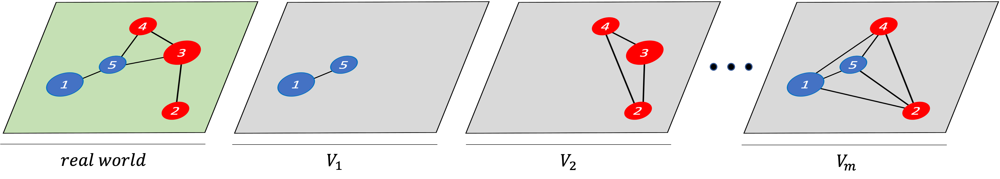
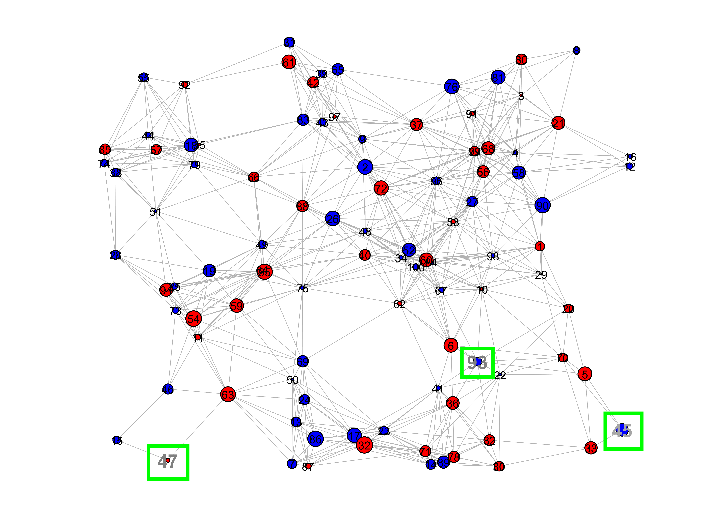
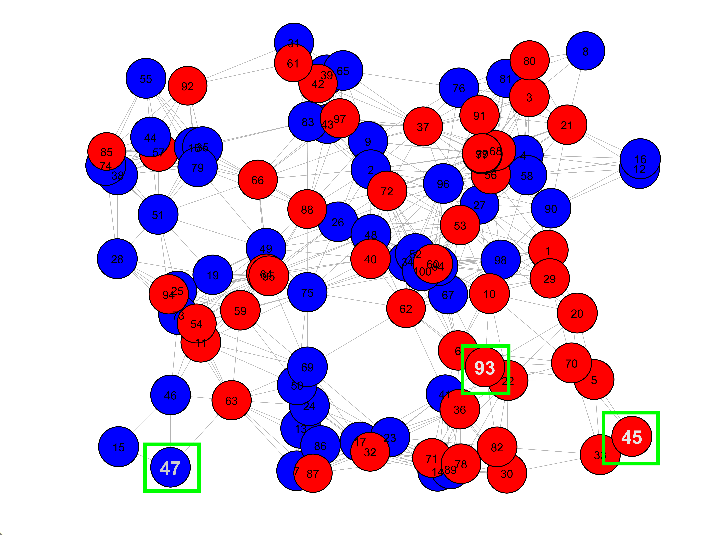
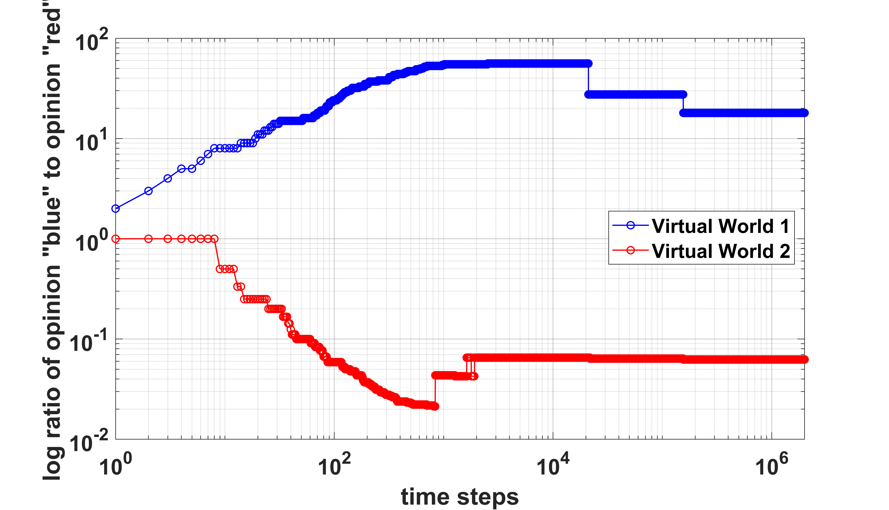

# Polarization in Social Media: A Virtual Worlds-Based Approach (06/30/2023)

By [Dennis Jacob](https://www.linkedin.com/in/dennis-jacob-072096234/), [Sven Banisch](http://www.universecity.de/)

Code for "[Polarization in Social Media: A Virtual Worlds-Based Approach](https://www.jasss.org/26/3/11.html)" in Journal of Artificial Societies And Social Simulation **26** (3) 11

## Overview

|  | 
|:--:| 
| *An illustration of the virtual worlds structure. All agents from the real world can optionally participate in as many "virtual worlds" as they wish. Note that each virtual world is complete, allowing for connections among agents which are not possible in the real world graph.* |

As social media becomes increasingly integrated within the fabric of our digital lives, it is clear that these platforms have a great impact on our mental well-being and interpersonal relationships. However, recent events and studies suggest that these changes are not always for the better as social media might contribute to social polarization. In this work, we leverage agent-based modelling (ABM) techniques to simulate the associated opinion dynamics of polarization in social media platforms. Specifically, we introduce a novel “virtual worlds” framework for representing an online social media platform. Agents from the neighbor constrained “real world” can “log-in” to these virtual worlds with a certain probability and participate in a complete network; this reflects the unique socioeconomic and geographic anonymity provided through social media. We find that the incorporation of virtual worlds can result in the simultaneous presence of different types of polarization in the real and virtual worlds.

## Requirements
Computational experiments were done using *MATLAB R2022a*

## Files

**Directory tree**

The following is a directory tree which specifies the organization of this project.

```shell
├── README.md                    # this file 
├── ComputationalGridSearch.m    # driver: perform h-lambda grid search with virtual worlds
├── EquivalencyTesting.m         # driver: compare model with and without adaptive exploration rate
├── VirtualWorldSingleRun.m      # driver: run virtual worlds model once and plot relevant metrics 
| 
├── Data Structures
|   ├── adjacencyMatrix.m        # function: convert graph from linkList to adjacencyMatrix representation
|   ├── connectedSRG.m           # function: generate spatial random graph (Erdos-Renyi) which is connected
|   ├── linkListTranslate.m      # function: convert graph from adjacencyMatrix to linkList representation
|   ├── spatialRandomGraph.m     # function: generate spatial random graph (Erdos-Renyi)
|   └── virtualWorlds.m          # class: virtual worlds, with methods to "login" and get current status
|
├── Metrics
|   └── congruentLinks.m         # function: given a linkList graph, computes congruent links percentage
| 
└── Visualization   
    └── drawSystemState.m        # function: given a linkList graph, plots all agents colored by opinion
```

**Usage**
- Use the *ComputationalGridSearch.m* file to perform the h-lambda grid search with virtual worlds. You can edit model parameters on lines 19-28 and additionally change the desired output file on line 56. Postprocessing of data must be done using another software (i.e., Microsoft Excel)
- Use the *EquivalencyTesting.m* file to compare the use of an adaptive exploration rate vs. a constant exploration rate. Note that the neither the virtual worlds nor homophily are incorporated in this script. You can edit model parameters on lines 16-24 and additionally change the desired output file on line 48. If the *single_run_plot_flag* option is specified, the time-series data associated with the metrics will be plotted along with the starting and ending system states for both models.
- Use the *VirtualWorldSingleRun.m* file to test the model with virtual worlds on a set of parameters. You can edit model parameters on lines 19-30. Time-series data associated with the metrics are plotted, along with the starting and ending system states.

## Sample runs
We include some plots from a sample run of the *VirtualWorldSingleRun.m* file with two virtual worlds. Note the presence of un-structural polarization the real world while there is structural polarization across the virtual worlds.

|  | 
|:--:| 
| *System state of the agents in the real world at the beginning of the simulation run. Color corresponds to which opinion an agent associates with, while size represents the strength of the conviction.* |

|  | 
|:--:| 
| *System state of the agents in the real world at the end of the simulation run. Note most agents have become strongly conviced in their associated opinion, but there are no large clusters; thus we have un-structural polarization in the real world.* |

|  | 
|:--:| 
| *Time evolution of virtual world ratios for the simulation run. Note that both virtual worlds demonstrate clearly distinct ratios, demonstrating structural polarization.* |

## Citation

```tex

@article{jacob2023,
   title = {Polarization in Social Media: A Virtual Worlds-Based Approach},
   author = {Jacob, Dennis and Banisch, Sven},
   journal = {Journal of Artificial Societies and Social Simulation},
   ISSN = {1460-7425},
   volume = {26},
   number = {3},
   pages = {11},
   year = {2023},
   URL = {http://jasss.soc.surrey.ac.uk/26/3/11.html},
   DOI = {10.18564/jasss.5170},
   keywords = {Agent-Based-Model (ABM), Polarization Structure, Homophily, Polarization, Social Media Platforms},
}		
```
